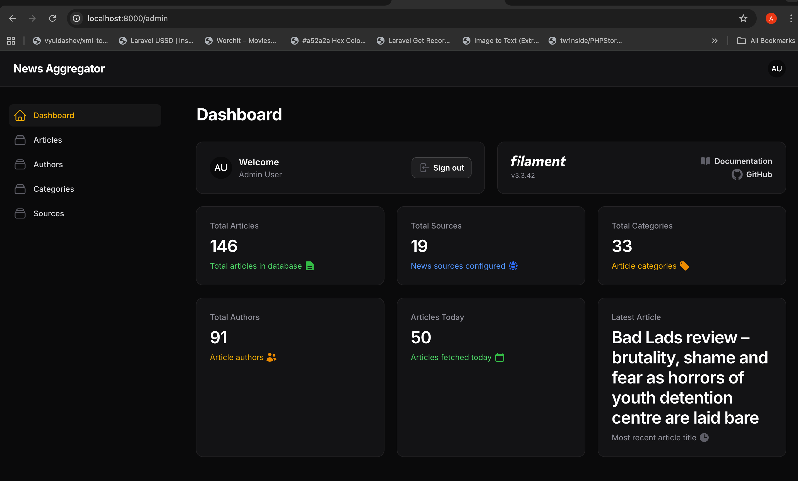
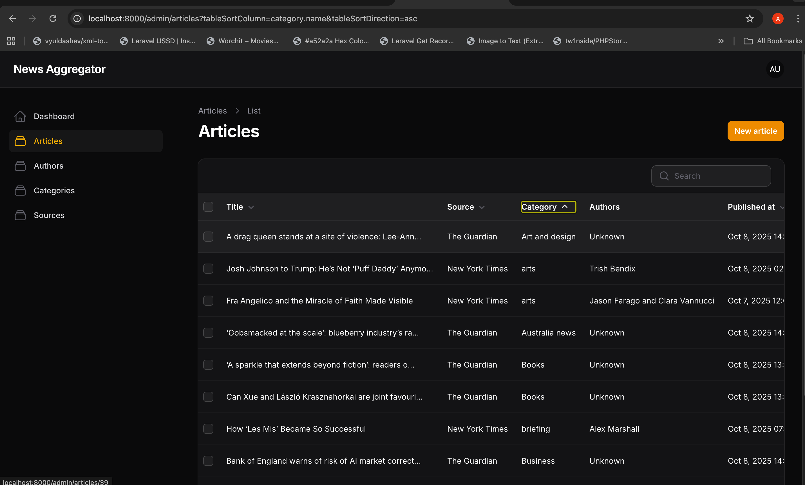
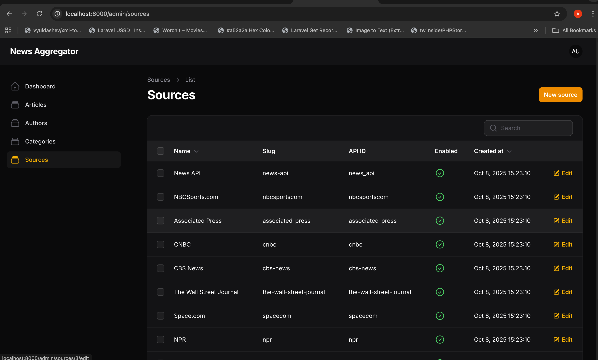
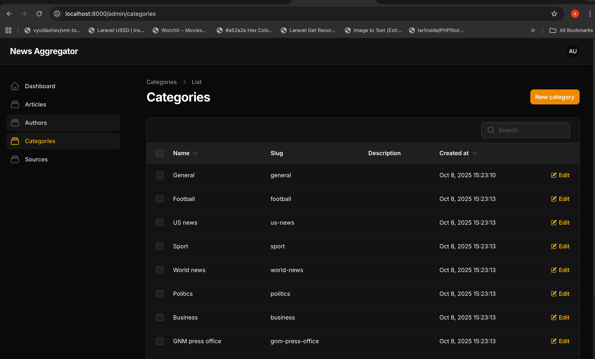
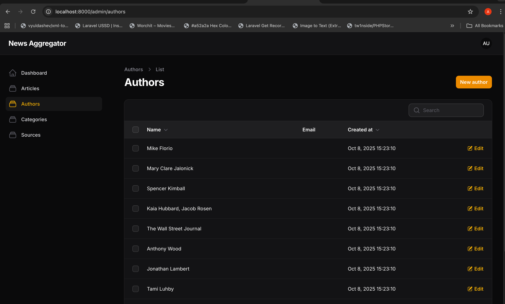
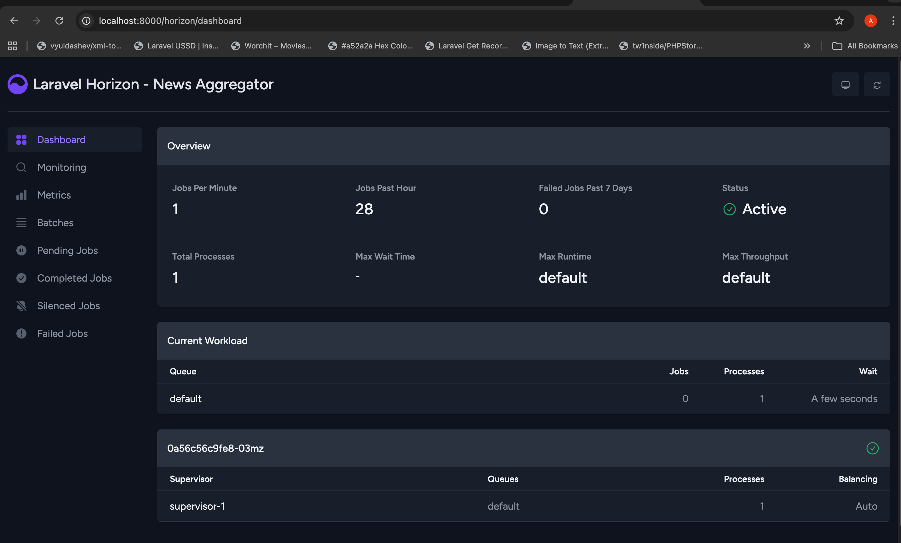
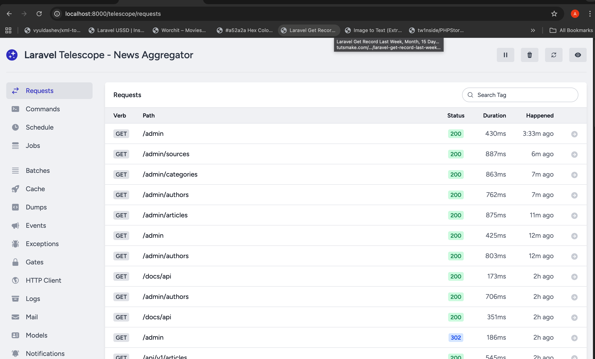
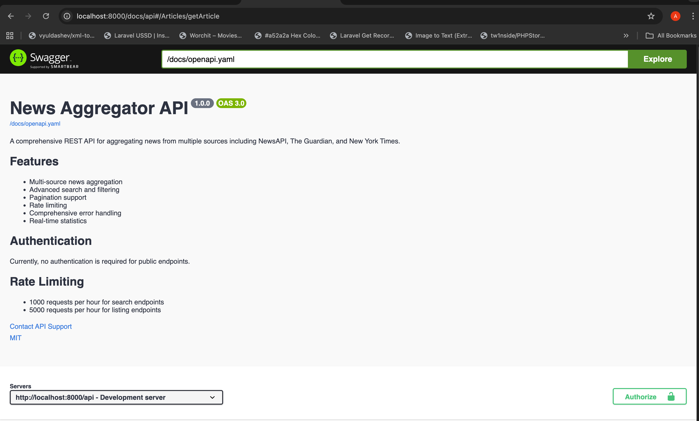
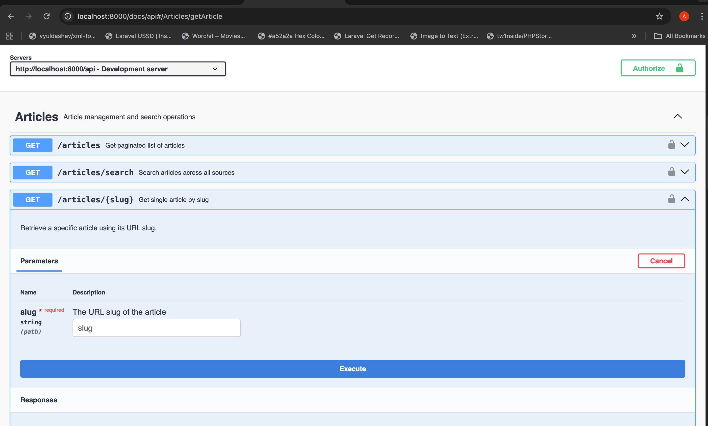

   # News Aggregator Backend

A Laravel-based news aggregation system that integrates multiple news sources and provides a clean, scalable architecture for content management.

   ## Features

- Multi-source news aggregation (NewsAPI, The Guardian, New York Times)
- RESTful API with comprehensive endpoints
- Admin dashboard with Filament
- Background queue processing with Laravel Horizon
- Docker containerization for development and production
- Clean architecture with repository pattern and service layer

   ## Tech Stack

- Laravel 11.x
- PHP 8.2
- MySQL 8.0
- Redis
- Docker & Docker Compose
- Nginx (production)
- Supervisor (production)

## Quick Start

   ### Prerequisites
- Docker and Docker Compose
   - Git

### Development Setup (Step-by-Step)

1. **Clone and enter the project**
   ```bash
   git clone https://github.com/oteng04/news-aggregator-backend.git
   cd news-aggregator-backend
   ```

2. **Copy environment file**
   ```bash
   cp .env.example .env
   ```
   *Note: The `.env` file contains your database credentials and API keys*

3. **Start all services (database, Redis, app)**
   ```bash
   docker compose up -d
   ```
   *Wait for all containers to start. This may take 1-2 minutes.*

4. **Install PHP dependencies**
   ```bash
   docker compose exec app composer install
   ```
   *Note: Requires containers to be running from step 3*

5. **Generate application key**
   ```bash
   docker compose exec app php artisan key:generate
   ```
   *Note: Requires containers to be running from step 3*

6. **Run database migrations**
   ```bash
   docker compose exec app php artisan migrate
   ```
   *Note: Requires containers to be running from step 3*

7. **Seed the database with sample data**
   ```bash
   docker compose exec app php artisan db:seed
   ```
   *Note: Requires containers to be running from step 3*

8. **Create admin user**
   ```bash
   docker compose exec app php artisan make:filament-user
   ```
   *Follow the prompts to create your admin username and password. Requires containers to be running from step 3*

9. **Start the Laravel development server**
   ```bash
   docker compose exec app php artisan serve --host=0.0.0.0 --port=8000
   ```
   *Keep this running in a separate terminal or run in background*

10. **Access your application**
    - **Main Application**: http://localhost:8000
    - **Admin Dashboard**: http://localhost:8000/admin *(use the credentials from step 8)*
    - **Queue Monitoring**: http://localhost:8000/horizon
    - **Debug Monitoring**: http://localhost:8000/telescope *(only in debug mode)*
    - **API Documentation**: http://localhost:8000/docs/api

### Troubleshooting

**If URLs don't work:**
1. Make sure the Laravel server from step 9 is running
2. Check container status: `docker compose ps`
3. Check logs: `docker compose logs app`

**If admin login doesn't work:**
1. Make sure you completed step 8 (create admin user)
2. Check that you have the correct username/password from the prompts

## Getting Started with Your Application

### After Setup - Useful Commands

**Fetch news articles from all sources:**
```bash
# Development
docker compose exec app php artisan news:fetch

# Production
docker compose -f docker-compose.prod.yml exec app php artisan news:fetch
```

**Start background queue processing:**
```bash
# Development
docker compose exec app php artisan horizon

# Production - Supervisor handles this automatically
```

**Clear application cache:**
```bash
docker compose exec app php artisan cache:clear
docker compose exec app php artisan config:clear
docker compose exec app php artisan route:clear
docker compose exec app php artisan view:clear
```

**Check application health:**
```bash
# Health check endpoint
curl http://localhost:8000/api/v1/health

# View application stats
curl http://localhost:8000/api/v1/stats
```

### Monitoring Your Application

- **Admin Dashboard** (`/admin`): Manage articles, sources, categories, and authors
- **Horizon** (`/horizon`): Monitor background job queues
- **Telescope** (`/telescope`): Debug requests and performance (development only)
- **API Docs** (`/docs/api`): Interactive API documentation

### Production Setup

1. **Update environment variables for production**
   ```bash
   # Edit .env file and set:
   APP_ENV=production
   APP_DEBUG=false
   APP_URL=http://your-production-domain.com
   ```

2. **Build and start production containers**
   ```bash
   docker compose -f docker-compose.prod.yml up -d --build
   ```
   *Note: Uses production Dockerfile with Nginx and Supervisor*

3. **Run production setup**
   ```bash
   docker compose -f docker-compose.prod.yml exec app php artisan migrate
   docker compose -f docker-compose.prod.yml exec app php artisan db:seed
   docker compose -f docker-compose.prod.yml exec app php artisan storage:link
   docker compose -f docker-compose.prod.yml exec app php artisan config:cache
   docker compose -f docker-compose.prod.yml exec app php artisan route:cache
   docker compose -f docker-compose.prod.yml exec app php artisan view:cache
   ```

4. **Create production admin user**
   ```bash
   docker compose -f docker-compose.prod.yml exec app php artisan make:filament-user
   ```

5. **Start queue worker for background processing**
   ```bash
   docker compose -f docker-compose.prod.yml exec app php artisan horizon
   ```
   *Or configure Supervisor to manage this automatically*

6. **Access production application**
   - Application: `http://your-production-domain.com`
   - Admin panel: `http://your-production-domain.com/admin`
   - Queue monitoring: `http://your-production-domain.com/horizon`
   - API documentation: `http://your-production-domain.com/docs/api`

## Available Endpoints

### Public API Endpoints

All API endpoints are versioned under `/api/v1/` and include rate limiting.

#### Articles
- `GET /api/v1/articles` - List articles with pagination and filters (100 requests/minute)
  - Query parameters: `page`, `per_page`, `source_id`, `category_id`, `search`
- `GET /api/v1/articles/search` - Search articles by text query (30 requests/minute)
  - Query parameters: `q` (required), `page`, `per_page`, `source_id`, `category_id`
- `GET /api/v1/articles/{slug}` - Get specific article by URL slug (200 requests/minute)

#### News Sources & Categories
- `GET /api/v1/sources` - List all news sources (100 requests/minute)
- `GET /api/v1/categories` - List all article categories (100 requests/minute)

#### System Monitoring
- `GET /api/v1/health` - System health check (no rate limit)
- `GET /api/v1/stats` - Application statistics (200 requests/minute)
- `GET /api/v1/metrics` - Detailed system metrics (200 requests/minute)

### Administrative Interfaces

These require authentication and are accessed through web browsers:

- **Admin Dashboard**: `/admin` - Content management and system overview

  

  
  
  
  

- **Queue Monitoring**: `/horizon` - Background job processing status

  

- **Debug Monitoring**: `/telescope` - Request debugging and performance monitoring

  

### API Documentation

- **Interactive API Docs**: `/docs/api` - OpenAPI/Swagger documentation for all endpoints

  

  

### API Usage Examples

```bash
# Get latest articles
curl "http://localhost:8000/api/v1/articles"

# Search for articles
curl "http://localhost:8000/api/v1/articles/search?q=technology"

# Get articles from specific source
curl "http://localhost:8000/api/v1/articles?source_id=1"

# Get specific article
curl "http://localhost:8000/api/v1/articles/sample-article-slug"

# Check system health
curl "http://localhost:8000/api/v1/health"
```

## Configuration

### Environment Variables

Copy `.env.example` to `.env` and configure the following:

```env
APP_NAME="News Aggregator"
APP_ENV=local
APP_KEY=  # Generate with: php artisan key:generate
APP_DEBUG=true
APP_URL=http://localhost:8000

# Database
DB_CONNECTION=mysql
DB_HOST=mysql
DB_PORT=3306
DB_DATABASE=news_aggregator_db
DB_USERNAME=your_db_username
DB_PASSWORD=your_db_password

# Redis
REDIS_HOST=redis
REDIS_PASSWORD=null
REDIS_PORT=6379

# Queue & Cache
CACHE_STORE=redis
QUEUE_CONNECTION=redis
SESSION_DRIVER=redis

# News API Keys
NEWSAPI_API_KEY=your_newsapi_key
GUARDIAN_API_KEY=your_guardian_key
NYT_API_KEY=your_nyt_key
```

## Project Structure

```
├── app/
│   ├── Services/           # News source integration services
│   ├── Repositories/       # Data access layer
│   ├── Filament/          # Admin panel components
│   └── Http/Controllers/  # API controllers
├── config/                # Laravel configuration files
├── database/
│   ├── migrations/       # Database schema migrations
│   └── seeders/         # Database seeders
├── docker/               # Production container configurations
├── routes/              # API and web routes
├── tests/              # Test suites
└── docker-compose.yml  # Development environment
```

## Testing

```bash
# Run all tests
docker compose exec app php artisan test

# Run specific test types
docker compose exec app php artisan test --testsuite=Unit
docker compose exec app php artisan test --testsuite=Feature
```

## Development Commands

```bash
# Fetch news articles
docker compose exec app php artisan news:fetch

# Clear cache
docker compose exec app php artisan cache:clear
docker compose exec app php artisan config:clear

# Run queue worker (development)
docker compose exec app php artisan queue:work
```

## Architecture Decisions

### Repository Pattern
Used for clean data access abstraction and testability.

### Service Layer
Business logic is encapsulated in service classes, keeping controllers thin.

### Queue Processing
News fetching is handled asynchronously to prevent timeouts and improve performance.

### Docker Containerization
Ensures consistent development and production environments.

## Performance Considerations

- Redis caching for frequently accessed data
- Database query optimization with eager loading
- Background processing for API calls
- MySQL performance tuning for production

## Security

- Input validation on all API endpoints
- Rate limiting on public endpoints
- CSRF protection on admin forms
- Secure environment variable handling
- SQL injection prevention via Eloquent ORM

## Monitoring

- Laravel Horizon for queue monitoring
- Laravel Telescope for debugging (development only)
- Structured logging with context
- Error tracking and reporting

  